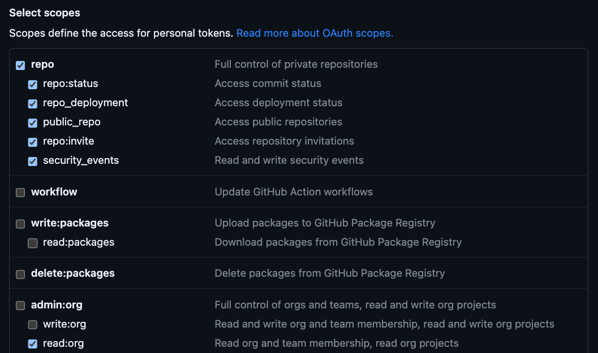

# Fetch Repos Info
## Goal
This script gathers information from the github repos you have access to in your organization.
## Installation
### Using virtual environment
```bash
python3 -m venv fetch-repos
source fetch-repos/bin/activate
pip3 install -r requirements.txt
```
### Global install
```bash
pip3 install --user -r requirements.txt
```
## Configuration
The API token needs the following requirements:
- personal access token classic
- permissions:



### Getting started
```bash
python3 extract_repo_info.py \
    -o codeclimate \
    -t $TOKEN \
    -f ./path.csv 
```

| Option                          | Value          | Description                                                                                                                        |
|---------------------------------|----------------|------------------------------------------------------------------------------------------------------------------------------------|
| -o                              | string         | your organization slug                                                                                                             |
| -t                              | string         | the token you want to use to execute the requests. The script requests the organization's team. An elevated user token is required |
| -f                              | file&nbsp;path | file to export the data to in a CSV format                                                                                         |
| &#8209;&#8209;append&#8209;only | N/A            | flag to resume work from where you left off                                                                                        | 

The script will generate a CSV, one line per repository, with data about commits, contribution activity and contributors.